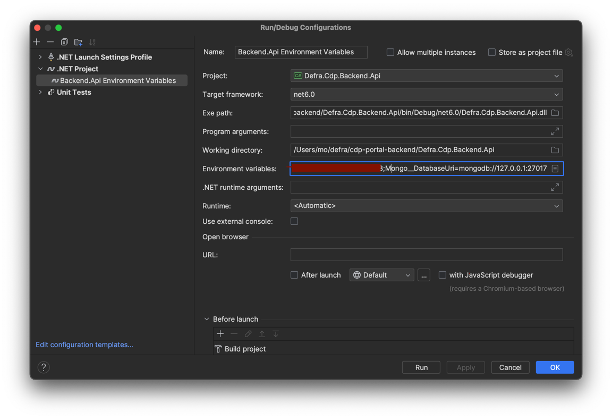
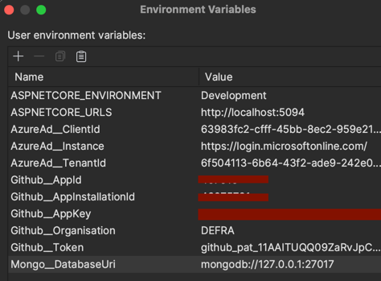

# CDP Portal Backend

A service for tracking deployments (what's deployed and where) across environments and for discovering, persisting and
providing access to all deployable artifacts on the platform (docker and ECR images).

[](https://github.com/DEFRA/cdp-portal-backend/actions/workflows/publish.yml)
[](https://github.com/DEFRA/cdp-portal-backend/actions/workflows/journey-tests.yml)

- [How does it work?](#how-does-it-work)
- [APIs](#apis)
    - [Find Services](#find-services)
    - [Get Artifacts](#get-artifacts)
    - [Getting content of a file](#getting-content-of-a-file)
    - [Getting lists of deployable artifacts](#getting-lists-of-deployable-artifacts)
    - [Admin backend](#admin-backend)
    - [Getting generic lists of deployments](#getting-generic-lists-of-deployments)
    - [Getting lists of deployments for each environment](#getting-lists-of-deployments-for-each-environment)
- [Local Development](#local-development)
    - [Install MongoDB](#install-mongodb)
        - [Start MongoDB](#start-mongodb)
            - [Run it natively](#run-it-natively)
            - [Running it in docker](#running-it-in-docker)
            - [Running it with Homebrew on Mac](#running-it-with-homebrew-on-mac)
        - [Inspect MongoDB](#inspect-mongodb)
    - [Run CDP Portal Backend application](#run-cdp-portal-backend-application)
    - [Setup a local docker registry](#setup-a-local-docker-registry)
    - [Install and run LocalStack AWS](#install-and-run-localstack-aws)
    - [Create local SQS queues](#create-local-sqs-queues)
    - [Simulating ECR SQS messages locally](#simulating-ecr-sqs-messages-locally)
    - [Generate fake deployments](#generate-fake-deployments)

## How does it work

TL;DR the CDP Portal Backend listens to SQS events for ECR image uploads and ECS deployments, populates a mongodb
database with that information,
and provides a RESTful API to access that information for the frontend.

**Deployments - the "what is where"**

`cdp-portal-backend` listens for AWS ECS deployment events on an SQS queue.

When an event comes in it will do the following:

- looks up the aws account id against a list of known environment names
- extracts the container image name and version from the event
- discards any containers that dont already exist
- writes the event to the deployments collection

**Artifacts and images - what we can deploy on the portal**

`cdp-portal-backend` listens for SQS events from the AWS ECR repository. When a new container is pushed, this service
will download the manifest of the image.
If it hasn't seen the image before it will attempt to retrieve all the layers of the image, including the config layer.
As it encounters files/data of interest it will read and
store this data.
Currently it extracts:

- Labels (specifically ones added during the build process to link it to the git repo that created it)
- Package.json (this is an example of how file extraction might work. In practice we'd want to search for
  package-lock.json etc)

## APIs

For the most up-to-date APIs and schema, run `cdp-portal-backend` locally, as instructed below, and navigate to
[the Swagger page at http://localhost:5094/swagger](http://localhost:5094/swagger).

### Find Entities

When an image is scanned its 'service name' is extracted from a docker label (`defra.cdp.service.name` see
ArtifactScanner.cs).

`GET /entities`

```json
[
    {
        "name": "cdp-portal-backend",
        "type": "Microservice",
        "subType": "Backend",
        "primaryLanguage": "JavaScript",
        "created": "2016-12-05T11:21:25Z",
        "teams": [
            {
                "teamId": "aabe63e7-87ef-4beb-a596-c810631fc474",
                "name": "Platform"
            }
        ],
        "status": "Success",
        "tags": ["live", "beta"]
    },
    {
        "name": "cdp-portal-frontend",
        "type": "Microservice",
        "subType": "Frontend",
        "primaryLanguage": "JavaScript",
        "created": "2016-12-05T11:21:25Z",
        "teams": [
            {
                "teamId": "aabe63e7-87ef-4beb-a596-c810631fc474",
                "name": "Platform"
            }
        ],
        "status": "Success",
        "tags": ["live"]
    }
]

```

`GET /entities/cdp-portal-backend`

```json
{
    "name": "cdp-portal-frontend",
    "type": "Microservice",
    "subType": "Frontend",
    "primaryLanguage": "JavaScript",
    "created": "2016-12-05T11:21:25Z",
    "teams": [
        {
            "teamId": "aabe63e7-87ef-4beb-a596-c810631fc474",
            "name": "Platform"
        }
    ],
    "status": "Success",
    "tags": ["live"]
}
```

### Get Artifacts

`GET /artifacts`

`GET /artifacts/foo/1.2.3`

```json

{
    "created": "2023-05-16T11:03:47.732Z",
    "repo": "cdp-portal-backend",
    "tag": "v0.21.0",
    "sha256": "sha256:157e63cedba182003e9831047e3f611c516e8d67a4425dfcb15d7d7295c17872",
    "githubUrl": "https://github.com/DEFRA/cdp-portal-backend",
    "serviceName": "cdp-portal-backend",
    "scannerVersion": 1,
    "files": [
        {
            "fileName": "Defra.Cdp.Deployments.deps.json",
            "path": "app/Defra.Cdp.Deployments.deps.json",
            "layerSha256": "sha256:115ae824b21b9f671e304112f034096061d8d56b655509561207084fd1f3ccde"
        }
    ]
}
```

### Getting content of a file

`GET /files/sha256:115ae824b21b9f671e304112f034096061d8d56b655509561207084fd1f3ccde?path=app%2FDefra.Cdp.Deployments.deps.json`
(you'll likely need to url encode the path parameter)

```json
{
    "name": "cdp-node-frontend-exemplar",
    "version": "0.1.0",
    "lockfileVersion": 3,
    "requires": true,
    "packages": {
        ...
```

Takes the layerSha256 value from the artifact data and the fileName as a query param.
Returns a 404 if the filename is invalid.
If you can retrieve the artifact, you have all the data required to access the file (digest and path).

### Getting lists of deployable artifacts

`GET /deployables`

`GET /deployables/image-name`

Both provide a list of docker image names and tags for that image.

### Admin backend

`POST /admin/scan?repo=foo&tag=1.2.3`
Triggers a scan of the given image/tag. This will grab the Docker image from ECR, scan the manifest and updates the
`artifacts` collection.

`POST /admin/backfill`
Rescan everything in the docker registry. This will take a long time!
Currently it will *not* drop the existing records, that should be done manually.

### Getting generic lists of deployments

`GET /deployments` returns the most recent deployment events, 1 per task. For services with more than one instance
you'll get 1 event per instance rather than the whole deployment

`GET /deployments/:deploymentId` returns details about a specific deployment

### Getting lists of deployments for each environment

`GET /running-services` return the most recent deployment for each service in each environment

`GET /running-services/:service` return the most recent deployment for a given service in each environment

### Get list of all Github repositories

`GET /repositories` returns all repositories for the organisation

`GET /repositories?team=exampleTeam` returns repositories owned by this team

`GET /templates` returns all repositories that are templates in the Portal

`GET /templates?team=exampleTeam` returns templates for a specific team

## Local Development

### Set up pre-commit script:
```bash
git config core.hooksPath .githooks
```

### Install MongoDB

- Install [MongoDB](https://www.mongodb.com/docs/manual/tutorial/#installation) on your local machine
    - Consider docker if running on Linux or WSL2 for Windows 10/11
    - Consider Homebrew for MacOS as Mongodb in docker for Apple Silicon can be temperamental

#### Start MongoDB

##### Run it natively

```bash
sudo mongod --dbpath ~/mongodb-cdp
```

##### Running it in docker

> Note: using the ubuntu image to avoid licensing issues with the ubi8 (redhat linux) image

```bash
docker run --name mongodb-cdp -d -p 27017:27017 mongodb/mongodb-community-server:6.0.7-ubuntu2204
```

##### Running it with Homebrew on Mac

> Note: if installing mongodb community edition

```bash
brew services start mongodb-community@6.0
```

#### Inspect MongoDB

To inspect the Database and Collections locally:

```bash
mongosh
```

### Run CDP Portal Backend application

- Set optional `ASPNETCORE_ENVIRONMENT` environment variable:

```bash
export ASPNETCORE_ENVIRONMENT=Development 
export GITHUB__TOKEN=<token_from_secret_manager>
```

- To run the `cdp-portal-backend` application:

```bash
dotnet run --project Defra.Cdp.Backend.Api --no-launch-profile
```

If you use Jetbrains Rider, make sure you create a configuration for `.NET Project` and not
`.NET Launch Setting Profile` so you can add your own environment variable there.
It should look something like this:



### Setup a local docker registry

Running a local docker registry enables the `cdp-portal-backend` to obtain the manifests from local registry images.

```bash
docker run -d -p 5000:5000 --restart=always --name registry registry:2
```

> Note: If you need to update the external port also change it in the `Docker.RegistryUrl` property within
`appsettings.Development.json`

You will then need to pull an image from ECR. This assumes you have AWS CLI setup correctly.

```bash
aws ecr get-login-password --region eu-west-2 --profile management | docker login --username AWS --password-stdin <account_number>.dkr.ecr.eu-west-2.amazonaws.com

docker pull  <account_number>.dkr.ecr.eu-west-2.amazonaws.com/cdp-portal-frontend:<version>
```

Then tag the pulled image

```bash
docker tag <account_number>.dkr.ecr.eu-west-2.amazonaws.com/cdp-portal-frontend:<version> localhost:5000/cdp-portal-frontend:<version>
```

The push the tagged image to your local docker registry

```bash
docker push localhost:5000/cdp-portal-frontend:<version> 
```

This will make sure that the `cdp-portal-backend` can obtain the manifest for the versions in our local MongoDB.

### Install and run LocalStack AWS

- Install [LocalStack AWS CLI](https://github.com/localstack/awscli-local)
- Run AWS LocalStack Docker container:

```bash
docker run --pull=always -d -p 4566:4566 -p 4510-4559:4510-4559 localstack/localstack:latest
```

### Create local SQS queues

- Create `ecs-deployments` local SQS queue:

```bash
awslocal sqs create-queue --queue-name ecs-deployments
```

### Simulating ECR SQS messages locally

Send a message to the `ecr-push-events` queue, simulates a docker image available in the docker registry, for
deployment.

This assumes:

- The AWS LocalStack Docker container is running and AWS LocalStack is installed.
- The appropriate docker image has been added to your local docker registry.

If you're not using AWS LocalStack, just replace the command with the normal aws command line + localstack connection
details.

- Create the `ecr-push-events` queue:

```bash
awslocal sqs create-queue --queue-name ecr-push-events
```

- Send an event:

```bash
awslocal sqs send-message --queue-url "http://127.0.0.1:4566/000000000000/ecr-push-events" --message-body '{"detail": { "result": "SUCCESS", "action-type": "PUSH", "image-tag": "0.1.0", "repository-name": "cdp-portal-frontend"}}'
```

### Generate fake deployments

To Generate fake deployments across environments.

This assumes:

- The appropriate docker image has been added to your local docker registry.
- An `ecr-push-events` SQS queue message has been sent

```bash
cd cdp-portal-backend
```

```bash
./generate-fake-deployments.sh service-name version
```

E.g:

```bash
./generate-fake-deployments.sh cdp-portal-frontend 0.1.0
```
